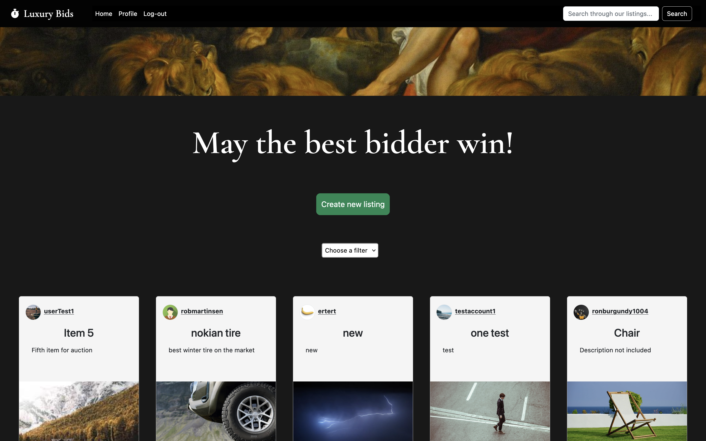

# Semester-Project-2



## Links

- [Kanban board (Trello)](https://trello.com/invite/b/GYfiN57v/ATTIbc307edaa1060eece339f07da9ed5555B4131781/semester-project-2)
- [Gantt chart (Team Gantt)](https://prod.teamgantt.com/gantt/schedule/?ids=3521205&public_keys=9v3409Bz08lK&zoom=d100&font_size=12&estimated_hours=0&assigned_resources=0&percent_complete=0&documents=0&comments=0&col_width=355&hide_header_tabs=0&menu_view=1&resource_filter=1&name_in_bar=0&name_next_to_bar=0&resource_names=1&resource_hours=1#user=&company=&custom=&date_filter=&hide_completed=&color_filter=)
- [Style guide (Adobe XD)](https://xd.adobe.com/view/53dc2c75-4928-4f3f-b3f8-5af94da391bd-068f/)
- [Prototype (Adobe XD)](https://xd.adobe.com/view/2cf94f87-8d07-4b5e-9899-be54efe0dfb4-79aa/)
- [Website demo (Netlify)](https://luxury-bids.netlify.app/index.html)

## Semester Project brief

An auction site is looking to launch a website where users can add items to be bid on and bid on items other users have put up for auction.

When a new user joins the website, they are given 1000 credits to use on the site. They can get credits by selling items and use credit by buying items. Non-registered users can search through the listings, but only registered users can make bids on listings.

## User stories

The client has specified the following requirements in the form of User Stories:

- A user with a stud.noroff.no email may register
- A registered user may login
- A registered user may logout
- A registered user may update their avatar
- A registered user may view their total credit
- A registered user may create a Listing with a title, deadline date, media gallery and description
- A registered user may add a Bid to another user’s Listing
- A registered user may view Bids made on a Listing
- An unregistered user may search through Listings

## Technical restrictions

The company CTO has set the following technical restrictions:

- Must use an approved CSS Framework
- Must be hosted on an approved Static Host
- Must use an approved Design Application
- Must use an approved Planning Application

## Required links

The Product Owner has requested links to the following:

- A Gantt chart for project timing
- A design prototype
- A style guide
- A kanban project board
- A repository link
- A hosted application demo link

## Delivery

Include the required links in the Moodle delivery window using this template format.

All final changes must be merged into the default branch main or master. Other branches will not be checked.

Ensure that the readme.md file describes your project thoroughly, including how to setup and run the project locally and any special instructions for testers.

# How to get started

**Clone the repo to your local computer:**

```
https://github.com/e0402/Semester-Project-2.git
```

**Install all dependencies:**

```
npm install
```

## Built using

- HTML
- Bootstrap
- SASS
- JavaScript
